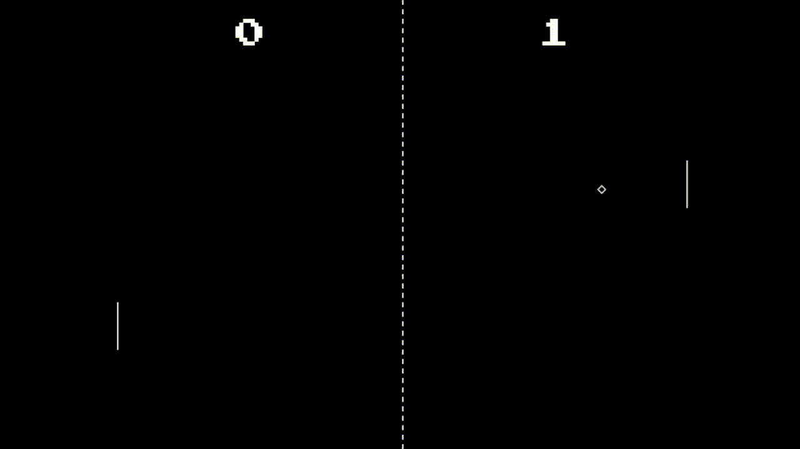

# Pong

C++ clone of Atari's arcade game Pong (1972).

## Installation

You will need the following development libraries:
- [SDL2](https://www.libsdl.org/)
- [SDL2_mixer](https://www.libsdl.org/projects/SDL_mixer/)
- [SDL2_ttf](https://libsdl.org/projects/SDL_ttf/)

For setting up the development libraries and running the project, please see this [Lazy Foo' tutorial](https://lazyfoo.net/tutorials/SDL/01_hello_SDL/index.php).

## License

[MIT](https://choosealicense.com/licenses/mit/)
